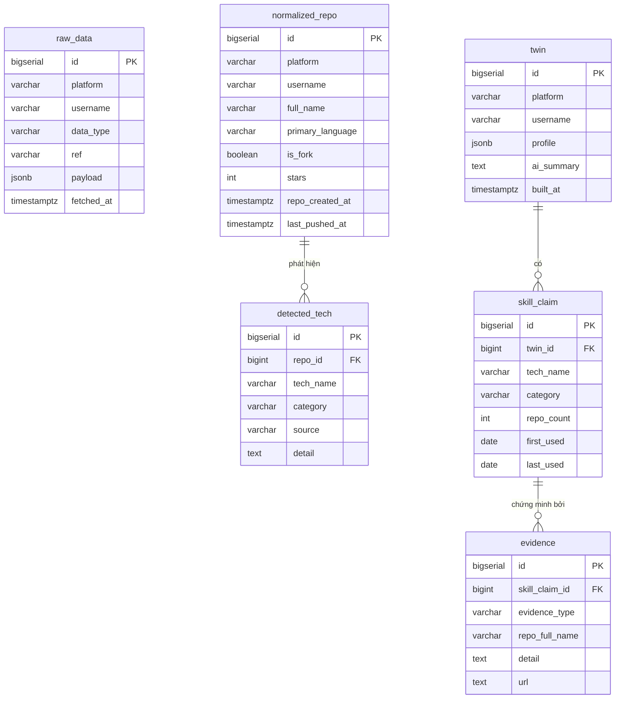

# Database Design

> PostgreSQL 16. Migration quản lý bằng Flyway (`backend/src/main/resources/db/migration/`).
> Schema chia theo 3 tầng, khớp với kiến trúc trong Readme: **Raw → Normalized → Twin/Knowledge**.

---

## Vì sao cần DB

1. **Cache dữ liệu GitHub** — rate limit 5000 req/giờ, fetch một lần rồi dùng lại.
2. **Evidence phải bền vững và truy vấn được** — mọi skill claim đều trỏ về bằng chứng cụ thể.
3. **Chạy lại từng tầng độc lập** — sửa Analyzer thì chỉ analyze lại, không cần fetch lại.

## Nguyên tắc thiết kế

- Mỗi tầng dữ liệu là một nhóm bảng riêng. Tầng sau **chỉ đọc** từ tầng trước, không sửa ngược.
- Dữ liệu thô giữ nguyên dạng JSONB (không mất thông tin). Dữ liệu đã phân tích dùng cột có kiểu rõ ràng (truy vấn được).
- Mọi bảng đều có cột thời gian để biết dữ liệu cũ hay mới.
- Chưa dùng Neo4j — quan hệ skill/evidence ở V1–V3 mô hình hoá tốt bằng bảng quan hệ. Package `knowledge` đã tách riêng nên sau này đổi storage không ảnh hưởng module khác.

## Sơ đồ tổng thể



Luồng dữ liệu: `raw_data` → (Analyzer) → `normalized_repo` + `detected_tech` → (Twin Engine) → `twin` + `skill_claim` + `evidence`.

Lưu ý: `evidence` tham chiếu repo bằng `repo_full_name` (text) thay vì FK sang `normalized_repo`, vì twin có thể được build lại trong khi normalized data bị xoá/tạo lại — evidence cần tự đứng vững như một "bản ghi bằng chứng".

---

## Tầng 1 — Raw Data (Milestone 1)

### `raw_data` — mọi thứ fetch về từ Connector, giữ nguyên không sửa

File migration: `V1__init.sql`

```sql
CREATE TABLE raw_data (
    id          BIGSERIAL PRIMARY KEY,
    platform    VARCHAR(50)  NOT NULL,              -- 'github' (sau này: 'gitlab', 'devto'...)
    username    VARCHAR(100) NOT NULL,
    data_type   VARCHAR(50)  NOT NULL,              -- 'profile' | 'repo' | 'languages' | 'readme'
                                                    -- | 'dependency_file' | 'commit_activity'
    ref         VARCHAR(500) NOT NULL DEFAULT '',   -- định danh phụ: tên repo, hoặc 'repo/path/to/file'
    payload     JSONB        NOT NULL,              -- response gốc từ API
    fetched_at  TIMESTAMPTZ  NOT NULL DEFAULT now(),

    CONSTRAINT uq_raw_data UNIQUE (platform, username, data_type, ref)
);

CREATE INDEX idx_raw_data_user ON raw_data (platform, username);
```

Cách dùng:

| data_type | ref | payload |
|---|---|---|
| `profile` | `''` | JSON từ `GET /users/{username}` |
| `repo` | tên repo | JSON của 1 repo |
| `languages` | tên repo | JSON từ Languages API |
| `readme` | tên repo | `{"content": "...đã decode base64..."}` |
| `dependency_file` | `repo/pom.xml` | `{"content": "..."}` |
| `commit_activity` | tên repo | JSON từ stats API |

- Fetch lại thì `UPSERT` (ON CONFLICT ... DO UPDATE) — mỗi mẩu dữ liệu chỉ có 1 bản mới nhất.
- Cache 24h của M1 = so sánh `fetched_at` với `now()`.

---

## Tầng 2 — Normalized (Milestone 2)

File migration: `V2__normalized.sql`

### `normalized_repo` — kết quả Analyzer, mỗi repo 1 dòng

```sql
CREATE TABLE normalized_repo (
    id               BIGSERIAL PRIMARY KEY,
    platform         VARCHAR(50)  NOT NULL,
    username         VARCHAR(100) NOT NULL,
    name             VARCHAR(255) NOT NULL,
    full_name        VARCHAR(255) NOT NULL,          -- 'username/repo-name'
    description      TEXT,
    primary_language VARCHAR(100),
    is_fork          BOOLEAN      NOT NULL DEFAULT FALSE,
    stars            INT          NOT NULL DEFAULT 0,
    repo_created_at  TIMESTAMPTZ,                    -- ngày tạo repo (cho timeline)
    last_pushed_at   TIMESTAMPTZ,                    -- lần push cuối (cho timeline)
    analyzed_at      TIMESTAMPTZ  NOT NULL DEFAULT now(),

    CONSTRAINT uq_normalized_repo UNIQUE (platform, full_name)
);

CREATE INDEX idx_normalized_repo_user ON normalized_repo (platform, username);
```

### `detected_tech` — tech phát hiện được trong từng repo, kèm nguồn

```sql
CREATE TABLE detected_tech (
    id        BIGSERIAL PRIMARY KEY,
    repo_id   BIGINT       NOT NULL REFERENCES normalized_repo(id) ON DELETE CASCADE,
    tech_name VARCHAR(100) NOT NULL,   -- tên chuẩn theo tech-catalog: 'spring-boot', 'redis'
    category  VARCHAR(50)  NOT NULL,   -- 'language' | 'framework' | 'database' | 'tool' | 'platform'
    source    VARCHAR(50)  NOT NULL,   -- 'languages_api' | 'maven' | 'gradle' | 'npm' | 'pip'
                                       -- | 'dockerfile' | 'docker_compose'
    detail    TEXT,                    -- vd: 'spring-boot-starter-data-redis trong pom.xml'

    CONSTRAINT uq_detected_tech UNIQUE (repo_id, tech_name, source)
);
```

- Cùng 1 tech có thể được phát hiện từ nhiều nguồn trong 1 repo (Redis từ cả `pom.xml` lẫn `docker-compose.yml`) → mỗi nguồn 1 dòng. Càng nhiều nguồn, evidence càng mạnh.
- Analyze lại = xoá `normalized_repo` của user đó (cascade xoá `detected_tech`) rồi ghi mới.
- Danh mục tech chuẩn (`tech_name`, `category`) nằm trong file `tech-catalog.json` ở backend resources, **không** phải bảng DB — vì nó là logic của Analyzer, sửa bằng code + test, không cần CRUD.

---

## Tầng 3 — Twin / Knowledge Graph (Milestone 3)

File migration: `V3__twin.sql`

### `twin` — mỗi developer 1 dòng, bản Twin mới nhất

```sql
CREATE TABLE twin (
    id           BIGSERIAL PRIMARY KEY,
    platform     VARCHAR(50)  NOT NULL DEFAULT 'github',
    username     VARCHAR(100) NOT NULL,
    display_name VARCHAR(255),
    profile      JSONB        NOT NULL,   -- avatar, bio, location, followers... (đã chuẩn hoá)
    ai_summary   TEXT,                    -- Gemini viết ở M4, NULL trước đó
    built_at     TIMESTAMPTZ  NOT NULL DEFAULT now(),

    CONSTRAINT uq_twin UNIQUE (platform, username)
);
```

### `skill_claim` — kết luận "developer biết X"

```sql
CREATE TABLE skill_claim (
    id         BIGSERIAL PRIMARY KEY,
    twin_id    BIGINT       NOT NULL REFERENCES twin(id) ON DELETE CASCADE,
    tech_name  VARCHAR(100) NOT NULL,
    category   VARCHAR(50)  NOT NULL,
    repo_count INT          NOT NULL,     -- dùng trong bao nhiêu repo (thước đo độ "đậm")
    first_used DATE,                      -- từ repo_created_at cũ nhất có tech này
    last_used  DATE,                      -- từ last_pushed_at mới nhất có tech này

    CONSTRAINT uq_skill_claim UNIQUE (twin_id, tech_name)
);
```

### `evidence` — bằng chứng cho từng claim (nguyên tắc: không evidence, không kết luận)

```sql
CREATE TABLE evidence (
    id             BIGSERIAL PRIMARY KEY,
    skill_claim_id BIGINT       NOT NULL REFERENCES skill_claim(id) ON DELETE CASCADE,
    evidence_type  VARCHAR(50)  NOT NULL,  -- 'dependency' | 'dockerfile' | 'language' | 'readme' | 'commit'
    repo_full_name VARCHAR(255) NOT NULL,  -- repo nào
    detail         TEXT         NOT NULL,  -- vd: 'khai báo spring-boot-starter-data-redis trong pom.xml'
    url            TEXT                    -- link thẳng đến file/repo trên GitHub (cho UI + Recruiter View)
);

CREATE INDEX idx_evidence_claim ON evidence (skill_claim_id);
```

- Build lại twin = xoá dòng `twin` cũ của user (cascade xoá claims + evidence) rồi ghi bản mới. Đơn giản, đúng với "Twin là snapshot mới nhất".
- `evidence.url` ví dụ: `https://github.com/user/repo/blob/main/pom.xml` — UI click là xem được bằng chứng thật.

---

## Lộ trình migration

| File | Tạo ở milestone | Nội dung |
|---|---|---|
| `V1__init.sql` | M0 | `raw_data` |
| `V2__normalized.sql` | M2 | `normalized_repo`, `detected_tech` |
| `V3__twin.sql` | M3 | `twin`, `skill_claim`, `evidence` |

Quy tắc Flyway: file đã chạy rồi thì **không sửa**, muốn đổi schema thì tạo file `V4__...` mới.

## Sẽ mở rộng sau (V2+ của roadmap, chưa làm bây giờ)

- `timeline_event` — sự kiện theo thời gian (repo mới, tech mới xuất hiện lần đầu)
- Quan hệ skill–skill cho Skill Graph (bảng `skill_relation` hoặc chuyển sang Neo4j nếu đồ thị phức tạp)
- `developer` tách khỏi `twin` khi 1 người có nhiều nguồn (GitHub + GitLab + Dev.to) cần merge identity
